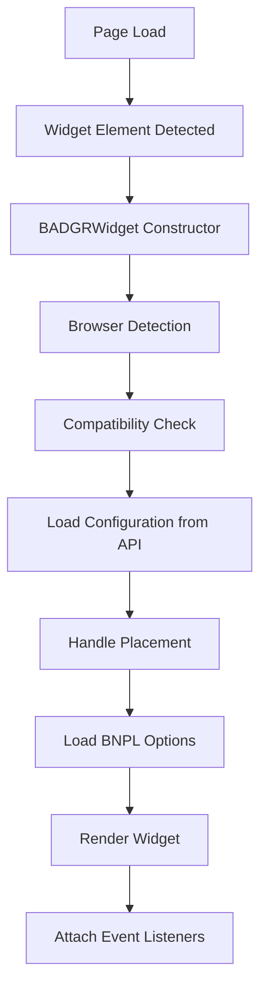

# BADGR Widget Rendering Logic Documentation

## Overview

The BADGR (Buy Now Pay Later) widget is a Shopify Theme App Extension that displays financing options to customers on product pages. The widget dynamically fetches and renders BNPL (Buy Now Pay Later) options based on merchant configuration and product information.

## Architecture

### Core Components

1. **BADGRWidget Class** (`badgr-widget.js`)
   - Main widget controller
   - Handles initialization, configuration, and rendering
   - Manages API communication and browser compatibility

2. **Liquid Template** (`blocks/bnpl-widget.liquid`)
   - Shopify theme integration
   - Merchant configuration interface
   - Widget container and initial markup

3. **Styling** (`badgr-widget.css`)
   - Cross-browser compatible styles
   - Responsive design
   - Placement-specific layouts

4. **Backend API** (`src/backend/routes/widgets.js`)
   - Widget configuration management
   - BNPL options generation
   - Analytics tracking

## Widget Initialization Flow



## Class Structure

### BADGRWidget Constructor

```javascript
constructor(element) {
  // Core properties
  this.element = element;              // Widget DOM element
  this.productId = element.dataset.productId;
  this.productPrice = parseFloat(element.dataset.productPrice);
  this.productCurrency = element.dataset.productCurrency || 'USD';
  this.widgetId = element.dataset.widgetId || 'default';
  this.placement = element.dataset.placement || 'below_price';
  this.showLogos = element.dataset.showLogos !== 'false';
  this.enabledProviders = this.getEnabledProviders();
  this.apiBaseUrl = this.getApiBaseUrl();
  
  // Browser compatibility
  this.browserInfo = this.detectBrowser();
  this.applyBrowserCompatibility();
  
  this.init();
}
```

### Key Methods

#### Configuration Management

**`loadWidgetConfiguration()`**
- Fetches dynamic configuration from backend API
- Merges API settings with template defaults
- Handles graceful fallback if API unavailable

```javascript
async loadWidgetConfiguration() {
  // 1. Get shop domain
  // 2. Check fetch support
  // 3. Call API: GET /api/widgets/{shopDomain}
  // 4. Merge configuration with template settings
  // 5. Update widget properties
}
```

#### Placement Handling

**`handlePlacement()`**
- Applies placement-specific CSS classes
- Dynamically positions widget based on configuration

**`findPriceElement()` / `findAddToCartButton()`**
- Theme-aware element detection
- Multiple fallback selectors for compatibility
- Visibility checking to ensure proper targeting

**`repositionWidget(targetElement, position)`**
- Safe DOM manipulation for widget positioning
- Prevents duplicate repositioning
- Error handling for edge cases

#### BNPL Options Rendering

**`loadBNPLOptions()`**
- Fetches available payment options from API
- Handles product-specific eligibility
- Renders options with proper styling and interactions

**`renderBNPLOptions(options)`**
- Creates HTML for each payment option
- Applies provider-specific styling
- Adds accessibility attributes

**`createOptionHTML(option)`**
- Generates individual option markup
- Includes logos, pricing, and terms
- Proper ARIA labels for accessibility

#### Browser Compatibility

**`detectBrowser()`**
- User agent parsing for browser identification
- Version detection for compatibility decisions
- Mobile/desktop classification

**`applyBrowserCompatibility()`**
- Applies browser-specific CSS classes
- Implements compatibility workarounds
- Warns about unsupported features

## API Integration

### Widget Configuration Endpoint

**Request:**
```http
GET /api/widgets/{shopDomain}
Headers:
  Content-Type: application/json
  X-Shopify-Shop-Domain: {shop.myshopify.com}
```

**Response:**
```json
{
  "success": true,
  "data": {
    "widget_enabled": true,
    "bnpl_enabled": true,
    "logo_selection": "default",
    "widget_placement": "below_price",
    "custom_settings": {
      "enabled_providers": ["klarna", "afterpay", "affirm"],
      "show_logos": true
    }
  }
}
```

### BNPL Options Endpoint

**Request:**
```http
POST /api/widgets/{widgetId}/options
Headers:
  Content-Type: application/json
  X-Shopify-Shop-Domain: {shop.myshopify.com}

Body:
{
  "productId": "12345",
  "price": 99.99,
  "currency": "USD",
  "enabledProviders": ["klarna", "afterpay"],
  "placement": "below_price"
}
```

**Response:**
```json
{
  "success": true,
  "options": [
    {
      "provider": "klarna",
      "displayName": "Klarna",
      "logoUrl": "/assets/klarna-logo.svg",
      "installmentText": "4 payments of $24.99",
      "terms": "Interest-free installments",
      "isEligible": true,
      "redirectUrl": "https://www.klarna.com/checkout?..."
    }
  ]
}
```

## Styling Architecture

### CSS Class Structure

```css
/* Base widget container */
.badgr-bnpl-widget { }

/* Browser-specific classes */
.badgr-browser-chrome { }
.badgr-browser-firefox { }
.badgr-browser-safari { }
.badgr-ie { }                /* Internet Explorer fallbacks */
.badgr-mobile { }            /* Mobile optimizations */

/* Placement-specific classes */
.badgr-placement-above_price { }
.badgr-placement-below_price { }
.badgr-placement-below_add_to_cart { }
.badgr-placement-custom { }

/* Component styling */
.badgr-bnpl-options { }      /* Options container */
.badgr-bnpl-option { }       /* Individual option */
.badgr-bnpl-logo { }         /* Provider logos */
.badgr-bnpl-text { }         /* Text content */
.badgr-bnpl-price { }        /* Price information */
.badgr-bnpl-terms { }        /* Terms and conditions */

/* State classes */
.badgr-bnpl-option:hover { }
.badgr-bnpl-option:focus { }
.badgr-bnpl-option.selected { }
.badgr-loading { }           /* Loading state */
.badgr-error { }             /* Error state */
```

### Responsive Design

- Mobile-first approach with progressive enhancement
- Touch target optimization (44px minimum on mobile)
- Viewport-based scaling for different screen sizes
- Dark mode support with `prefers-color-scheme`

## Event Handling

### User Interactions

**Click/Touch Events:**
```javascript
handleOptionClick(event) {
  // 1. Track analytics event
  // 2. Update visual state (selection)
  // 3. Handle redirect to provider
  // 4. Provide user feedback
}
```

**Keyboard Navigation:**
- Tab navigation between options
- Enter/Space to activate options
- Proper focus management
- Screen reader compatibility

### Analytics Tracking

**Events Tracked:**
- `widget_loaded` - Widget initialization
- `option_selected` - User selects payment option
- `option_clicked` - Click tracking for analytics

**Integration Points:**
- Shopify Analytics
- Google Analytics (gtag)
- Custom tracking endpoint

## Configuration Options

### Theme Editor Settings

```liquid

{
  "settings": [
    {
      "type": "text",
      "id": "widget_id",
      "label": "Widget ID",
      "default": "default"
    },
    {
      "type": "checkbox",
      "id": "show_logos",
      "label": "Show provider logos",
      "default": true
    },
    {
      "type": "select",
      "id": "placement",
      "label": "Widget placement",
      "options": [
        {"value": "above_price", "label": "Above price"},
        {"value": "below_price", "label": "Below price"},
        {"value": "below_add_to_cart", "label": "Below add to cart"},
        {"value": "custom", "label": "Custom position"}
      ]
    }
  ]
}

```

### API Configuration

Merchants can override theme settings via the admin interface:
- Enable/disable widget globally
- Configure enabled BNPL providers
- Customize placement behavior
- Set provider-specific settings

## BNPL Provider Configuration

### Supported Providers

| Provider | Min Amount | Max Amount | Installments | Notes |
|----------|------------|------------|--------------|-------|
| Klarna | $1 | $10,000 | 4 | Most popular |
| Afterpay | $1 | $2,000 | 4 | Strict limits |
| Affirm | $50 | $30,000 | 3-36 | Flexible terms |
| Sezzle | $1 | $2,500 | 4 | Youth focused |
| Zip | $1 | $1,500 | 4 | Australian origin |
| PayPal Credit | $99 | $10,000 | 6+ | Requires account |

### Eligibility Rules

```javascript
const providerConfigs = {
  klarna: {
    eligibilityRules: (price) => price >= 1 && price <= 10000
  },
  // ... other providers
};
```

## Error Handling

### API Errors
- Network failures gracefully degrade to template settings
- Invalid responses show user-friendly error messages
- Timeout handling with fallback content

### Browser Incompatibility
- Feature detection prevents errors in unsupported browsers
- Console warnings inform developers of limitations
- Graceful degradation maintains basic functionality

### Placement Failures
- Element detection failures fall back to default placement
- Missing target elements use alternative selectors
- Repositioning errors logged but don't break widget

## Performance Considerations

### Loading Strategy
- Deferred script loading to prevent render blocking
- Lazy loading of provider logos
- Minimal DOM manipulation during initialization

### Memory Management
- Event listener cleanup on widget destruction
- Proper disposal of widget instances
- No memory leaks on page navigation

### Caching
- API responses can be cached for session duration
- Logo assets cached by browser
- Configuration cached until page reload

## Testing

### Unit Tests
```javascript
describe('BADGRWidget', () => {
  test('initializes with correct properties', () => {
    const widget = new BADGRWidget(mockElement);
    expect(widget.productId).toBeDefined();
    expect(widget.browserInfo).toBeDefined();
  });
});
```

### Integration Tests
- API endpoint testing with various configurations
- Cross-browser compatibility validation
- Theme compatibility testing

### Manual Testing Checklist
- [ ] Widget displays in all placements
- [ ] API integration works correctly
- [ ] Browser compatibility verified
- [ ] Accessibility compliance confirmed
- [ ] Performance benchmarks met

## Deployment

### Build Process
```bash
# No build process required - pure JavaScript/CSS
# Files are served directly from theme extension
```

### Monitoring
- Console error tracking in production
- API response time monitoring
- User interaction analytics
- Browser compatibility metrics

## Troubleshooting

### Common Issues

**Widget Not Appearing:**
1. Check console for JavaScript errors
2. Verify API connectivity
3. Confirm theme compatibility
4. Check browser support

**Incorrect Placement:**
1. Verify target element selectors
2. Check theme-specific modifications needed
3. Confirm placement configuration

**API Errors:**
1. Check backend server status
2. Verify API keys and configuration
3. Confirm shop domain matching

### Debug Mode

Enable debug logging:
```javascript
window.BADGR_DEBUG = true;
// Provides detailed console output for troubleshooting
```

## Future Enhancements

### Planned Features
- Additional BNPL providers
- Advanced placement options
- Enhanced analytics integration
- Improved theme compatibility
- A/B testing capabilities

### Technical Debt
- Consider modern JavaScript bundling
- Evaluate TypeScript migration
- Implement automated testing pipeline
- Add performance monitoring

## Version History

- **v1.0.0** - Initial release with core functionality
- **v1.1.0** - Added cross-browser compatibility
- **v1.2.0** - Enhanced placement handling
- **v1.3.0** - API integration improvements

---

*This documentation should be updated with each significant change to the widget implementation.* 